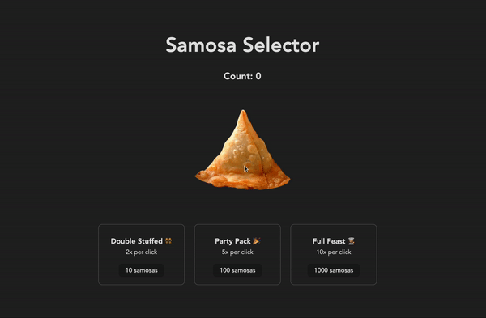

# Samosa-Rush
A game called Samosa Selector that is based on an incremental game called Cookie Clicker. The goal of the game is to produce as many cookies by clicking on the Big Cookie as you can. However, in this version, instead of clicking a cookie, the user will be selecting a delicious samosa.

## Gameplay
The game starts out with the user having zero samosas. When the user clicks the Big Samosa, it initially produces one samosa per click. Then,

- When the user has 10 samosas, they can buy a Double Stuffed upgrade, which produces double the amount of samosas per click.
- When the user has 100 samosas, they can buy the Party Pack upgrade, which produces 5x the amount of samosas per click.
- When the user has 1000 samosas, they can buy the Full Feast upgrade, which produces 10x the amount of samosas per click.
The game continues on forever and the user can continue to gain gigantic amounts of samosas. Yum!


## Video Walkthrough

Here's a walkthrough shows the game:



<!-- Replace this with whatever GIF tool you used! -->
GIF created with [LiceCap](http://www.cockos.com/licecap/).


## Setup/Run Steps

### Dependencies

* [Vite](https://www.npmjs.com/package/vite)
* [Vite React Plugin](https://www.npmjs.com/package/@vitejs/plugin-react)
* [React](https://www.npmjs.com/package/react)
* [React-DOM](https://www.npmjs.com/package/react-dom)

---

### Install Dependencies

Before installing dependiencies, you will need `node` and `npm` installed globally on your machine by installing  [NodeJS](https://nodejs.org/en/download/) onto your machine.

To install the dependencies, run:

```sh
npm install
```

Alternatively, you can install the dependencies individually:

```sh
npm install vite
npm install @vitejs/plugin-react
npm install react
npm install react-dom
```

---

### Run Samosa Selector

In the repo directory, run the following in your terminal:

```sh
npm run dev

```

Visit the web application in the browser:

```html
http://localhost:5173/
```

<br/>

---
<!--

### Deploy Community Board

To deploy this application on Netlify, run the following in your terminal:
```sh
npm install
npm run build
```

Upload the generated `dist` file to Netflify at:
```html
https://app.netlify.com/drop
```
-->
*Last Updated: February 2023*

View an example of what was implemented [here](https:https://helpful-griffin-0a0ba5.netlify.app/)!

